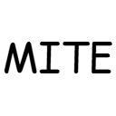

<dir>

    

<h3 align="center">someitem+</h3>
    

Someitem+ for Minecraft 1.21.1
     
    <a href="https://github.com/oneachina/SomeitemPlus/issues">Report Bug</a>
    ·
    <a href="https://github.com/oneachina/SomeitemPlus/issues">Request Feature</a>
    ·
    <a href="https://github.com/oneachina/SomeitemPlus/blob/master/README.md">English</a>

</dir>

# 调整
(~~MITE: Reborn~~) Someitem+ 的初衷是基于原 Someitem 进行二次更新和优化，并且对 Someitem 进行了优化。

特别提示：嘻嘻 变成someitem+了 实际上把原版fabric删了awa
_SomeItem Neoforge But Fabric_

# 前置
fabric Api and Fabric

Minecraft 1.21.1
